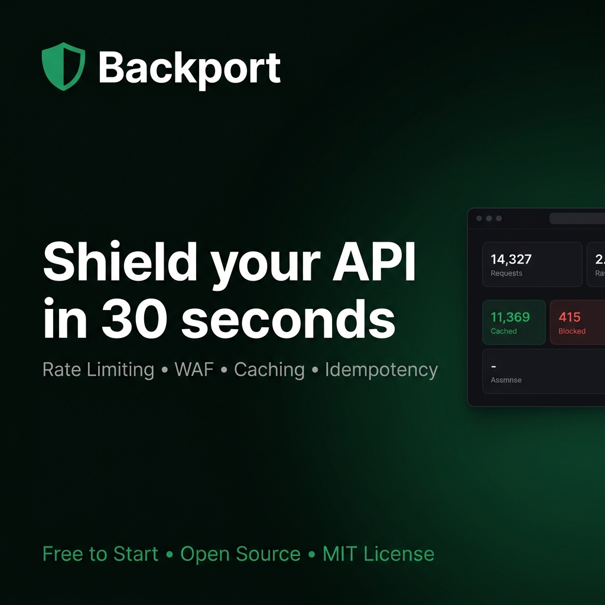
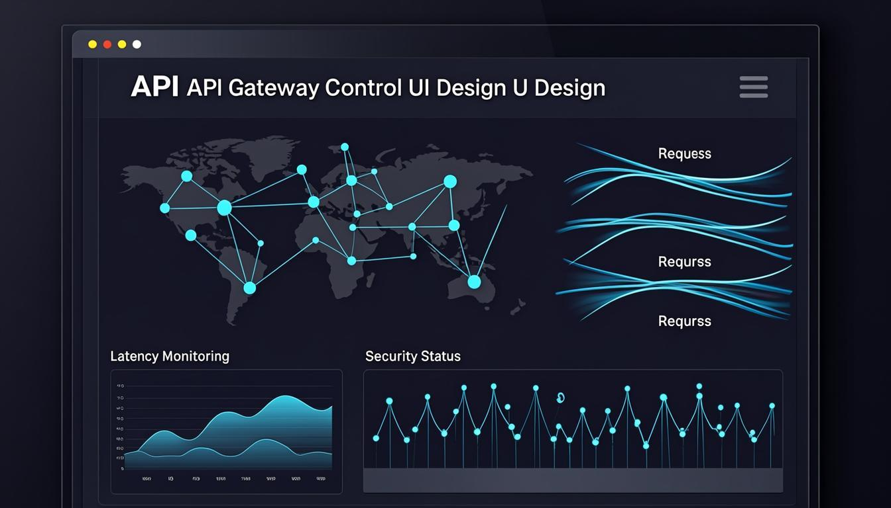
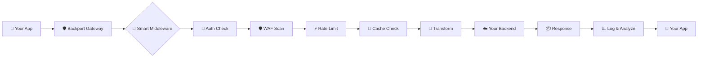
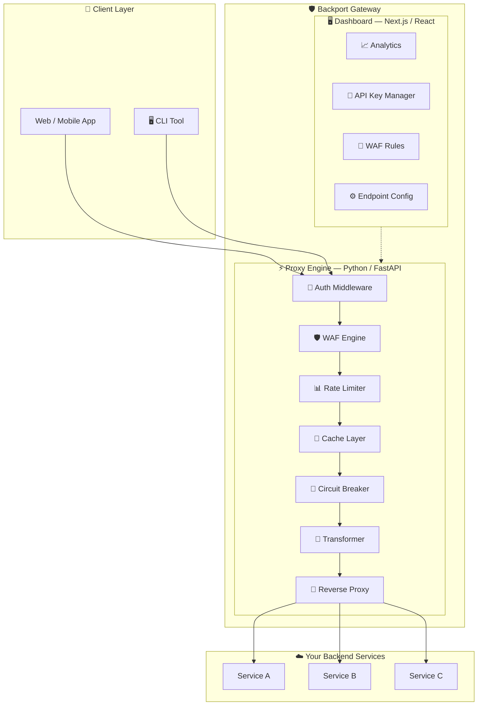

<div align="center">

<!-- Logo -->


# 🛡️ Backport

**The API Gateway That Actually Works — No SDK, No Code Changes, Deploy in 30 Seconds**

[🌐 Live Demo](https://backport.in) &nbsp;&middot;
[📖 Docs](https://backport.in/docs) &nbsp;&middot;
[📝 Changelog](https://backport.in/changelog) &nbsp;&middot;
[🐛 Report Bug](https://github.com/Qureshi-1/Backport-io/issues/new?template=bug_report.yml)

<!-- Tech Stack Badges -->
<p>
  
  &nbsp;
  
  &nbsp;
  
  &nbsp;
  
  &nbsp;
  
  &nbsp;
  
</p>

<!-- Status Badges -->
<p>
  
  &nbsp;
  
  &nbsp;
  
  &nbsp;
  
  &nbsp;
  
</p>

<!-- Social Badges -->
<p>
  
  &nbsp;
  
</p>

</div>

<!-- Dashboard Preview -->
<picture>
  <source media="(prefers-color-scheme: dark)" srcset="frontend/public/demo-video.webp">
  
</picture>

---

## ✨ What is Backport?

Backport is a **production-grade API Gateway** that sits between your clients and backend services. It gives you enterprise-level protection, performance optimization, and full observability — without requiring any SDK, code changes, or complex setup.

> 💡 Think of it as a **Cloudflare for APIs** — but self-hosted, open-source, and fully customizable.

**Just point your API traffic through Backport and instantly get:**

| | |
|---|---|
| 🛡️ **WAF** | Block SQL injection, XSS, path traversal, command injection |
| ⚡ **Rate Limiting** | Throttle requests per endpoint, user, or IP |
| 💾 **Smart Caching** | LRU cache with Redis support — slash your backend load |
| 🔄 **Response Transformation** | Add, remove, rename API fields on the fly |
| 🎭 **API Mocking** | Create mock endpoints for frontend development |
| 📊 **Real-time Analytics** | Live metrics, latency tracking, error rates |
| 🏗️ **Circuit Breaker** | Automatic failover for downstream protection |
| 📋 **Request Inspector** | Full audit trail with one-click replay |

---

## 🚀 How It Works (in 30 seconds)



Your backend doesn't change. Your clients don't change. **Backport handles everything in between.**

---

## 🎯 Why Backport?

### The Problem
Most API gateways are either enterprise-only ($$$), require complex SDK integrations, or force you to rewrite your backend. Developers waste weeks setting up WAF, rate limiting, caching, and monitoring separately.

### The Solution
Backport gives you **all of this in one tool** — deploy in 30 seconds, configure through a beautiful dashboard, and monitor everything from a single pane of glass.

```
❌ Other Gateways              ✅ Backport
─────────────────────         ─────────────────────
Enterprise pricing only        Free tier available
SDK required                   Zero SDK — just route traffic
Complex setup                  Deploy in 30 seconds
Separate tools for each        All-in-one solution
Closed source                  100% Open Source (MIT)
```

---

## 🔥 Feature Showcase

### 🛡️ Security & Protection
| Feature | Description |
|---|---|
| 🔒 **Web Application Firewall** | Built-in detection for SQL injection, XSS, path traversal, and command injection attacks |
| 🎯 **Custom WAF Rules** | Create your own regex-based firewall rules with per-endpoint control, severity levels, and block/log modes |
| 🔑 **API Key Auth** | Per-endpoint key management with scoped permissions and automatic key rotation |
| 🌐 **OAuth Support** | Google & GitHub login for seamless team onboarding |
| 🔌 **Circuit Breaker** | Automatic failover and recovery for downstream service protection |
| 🚫 **IP Blocking** | Block malicious IPs and suspicious request patterns |

### ⚡ Performance & Optimization
| Feature | Description |
|---|---|
| 💾 **Intelligent Caching** | In-memory LRU cache with configurable TTL; Redis/Upstash support for distributed caching |
| 📊 **Rate Limiting** | Request throttling per endpoint, per user, or per IP — with plan-based scaling |
| 🔄 **Response Transformation** | Add, remove, rename, and filter fields from API responses on the fly — no backend changes |
| ♻️ **Idempotency** | Prevent duplicate request processing with automatic idempotency key management |
| 🗜️ **GZip Compression** | Automatic response compression to reduce bandwidth |

### 📊 Observability & Monitoring
| Feature | Description |
|---|---|
| 📈 **Real-time Analytics** | Live request metrics, latency tracking, error rates, and throughput monitoring via WebSocket |
| ❤️ **Health Monitoring** | Automated health checks with 24h status history, alerting, and uptime tracking |
| 🔍 **Request Inspector** | Full audit trail of every API request with JSON/CSV export and one-click replay |
| 📋 **Auto API Documentation** | Automatic endpoint discovery with OpenAPI export, starring, and inline docs |

### 🛠️ Developer Experience
| Feature | Description |
|---|---|
| 🎭 **API Mocking** | Create mock endpoints with pattern matching and method filtering for frontend development |
| 🪝 **Webhooks** | Event-driven notifications with HMAC-signed delivery |
| 👥 **Team Management** | Role-based access control (Owner, Admin, Member, Viewer) with team invitations |
| 📢 **Slack & Discord** | Real-time alerts and notifications in your team channels |
| 🖥️ **CLI Tool** | Manage your gateway from the terminal with the `backport` CLI |
| ⚙️ **Endpoint Configuration** | Per-endpoint settings for caching, rate limits, WAF rules, and authentication |

---

## 💻 Quick Start

### Prerequisites
-  Node.js 18+
-  Python 3.10+
- 🐳 Docker (optional)

### 1️⃣ Clone the Repository

```bash
git clone https://github.com/Qureshi-1/Backport-io.git
cd Backport-io
```

### 2️⃣ Setup Backend

```bash
cd backend

# Create and activate virtual environment
python -m venv venv
source venv/bin/activate  # Windows: venv\Scripts\activate

# Install dependencies
pip install -r requirements.txt

# Configure environment
cp ../.env.example .env

# Start the server
uvicorn main:app --reload --port 8080
```

### 3️⃣ Setup Frontend

```bash
cd frontend

# Install dependencies
npm install

# Start development server
npm run dev
```

### 4️⃣ Install CLI

```bash
# macOS / Linux
curl -sSL https://raw.githubusercontent.com/Qureshi-1/Backport-io/main/frontend/public/install.sh | bash

# Windows (PowerShell)
irm https://raw.githubusercontent.com/Qureshi-1/Backport-io/main/frontend/public/install.ps1 | iex

# Verify
backport --help
```

> 🚀 Frontend at `http://localhost:3000` · Backend API at `http://localhost:8080`

---

## 📁 Project Structure

```
Backport-io/
├── 📂 backend/                    # Python FastAPI gateway engine
│   ├── main.py                    #   App entry point & middleware pipeline
│   ├── proxy.py                   #   Reverse proxy & request routing
│   ├── auth.py                    #   Authentication & API key management
│   ├── waf.py                     #   Web Application Firewall engine
│   ├── custom_waf.py              #   User-defined WAF rule processor
│   ├── rate_limiter.py            #   Rate limiting engine
│   ├── cache.py                   #   Response caching layer
│   ├── circuit_breaker.py         #   Circuit breaker pattern
│   ├── transform.py               #   Response transformation
│   ├── mock.py                    #   API mocking engine
│   ├── analytics.py               #   Request analytics & metrics
│   ├── health_monitor.py          #   Health check system
│   ├── webhooks.py                #   Webhook event delivery
│   ├── teams.py                   #   Team & RBAC management
│   ├── payment.py                 #   Subscription & billing
│   ├── integrations.py            #   Third-party integrations
│   ├── models.py                  #   Database models (SQLAlchemy)
│   ├── database.py                #   Database configuration
│   └── config.py                  #   Application configuration
│
├── 📂 frontend/                   # Next.js 16 dashboard
│   ├── src/
│   │   ├── app/                   #   App Router pages & layouts
│   │   │   ├── dashboard/         #     17 dashboard pages
│   │   │   ├── blog/              #     Blog & announcements
│   │   │   ├── docs/              #     Documentation portal
│   │   │   └── auth/              #     Login, signup, verification
│   │   ├── components/            #   React UI components
│   │   └── lib/                   #   Utilities & helpers
│   └── public/                    #   Static assets & icons
│
├── 📂 .github/                    # GitHub templates & CI workflows
├── .env.example                   # Environment variable template
├── vercel.json                    # Vercel deployment config
└── render.yaml                    # Render deployment config
```

---

## 🏗️ Architecture



---

## 💰 Pricing

| | 🆓 Free | 💎 Plus | 🚀 Pro | 🏢 Enterprise |
|---|---|---|---|---|
| **Price** | $0 forever | $5.99/mo | $11.99/mo | Custom |
| **Requests** | 10K/mo | 100K/mo | 1M/mo | Unlimited |
| **API Keys** | 1 | 3 | 10 | Unlimited |
| **Caching** | ✅ In-memory | ✅ In-memory | ✅ Redis | ✅ Redis |
| **WAF** | Basic | Advanced | Advanced + Custom | Full Suite |
| **Team Members** | 1 | 3 | 10 | Unlimited |
| **Support** | Community | Email | Priority | Dedicated |

> 🎉 Start free — no credit card required. Upgrade anytime.

---

## 🛠️ Tech Stack

| Layer | Technologies |
|---|---|
| **Frontend** |     |
| **Animation** |   |
| **Backend** |    |
| **Database** |   |
| **Cache** |   |
| **Auth** |   |
| **Deploy** |   |
| **CI/CD** |  |

---

## 🏗️ Deployment: Managed Cloud vs. Self-Hosted

Backport runs the same codebase in both modes. Here's what changes:

| | ☁️ **Managed Cloud** ([backport.in](https://backport.in)) | 🏠 **Self-Hosted** (your server) |
|---|---|---|
| **Database** | PostgreSQL (Supabase) | SQLite (zero config) or PostgreSQL |
| **Cache** | Redis / Upstash (distributed) | In-memory LRU (single worker) |
| **Workers** | Multi-worker, auto-scaling | Single worker (`uvicorn`) |
| **Rate Limiting** | Persistent across restarts | In-memory, resets on restart |
| **Analytics** | Persistent history, real-time WebSocket | In-memory, resets on restart |
| **WAF Rules** | Full suite + custom rules | Full suite + custom rules |
| **Setup** | Sign up, get API key in 30s | Clone repo, configure, run |
| **Cost** | Free tier + paid plans | Free (your infra) |

> **Recommendation:** Use **Managed Cloud** for production — persistent data, Redis caching, and zero ops. Use **Self-Hosted** for development, testing, or air-gapped environments.

---

## 🚢 Deployment

### ☁️ Vercel (Frontend — One Click)

Connect your GitHub repo to Vercel and it auto-deploys on every push to `main`.

<details>
<summary>🔧 Manual Vercel Setup</summary>

1. Fork & clone this repo
2. Go to [vercel.com/new](https://vercel.com/new)
3. Import your GitHub repo
4. Set root directory to `frontend`
5. Deploy!

</details>

### 🐳 Docker (Backend)

```bash
docker build -t backport-backend ./backend
docker run -p 8080:8080 --env-file .env backport-backend
```

### ☁️ Render (Backend)

```bash
# Using render.yaml blueprint
render deploy
```

### 🔑 Environment Variables

See [`.env.example`](.env.example) for the complete list of required environment variables.

---

## 📜 API Proxy Usage

Once deployed, route your API calls through Backport:

```bash
# Before (direct to backend)
curl https://your-backend.com/api/users

# After (through Backport gateway — just add one header)
curl -H "X-API-Key: bk_your_api_key" https://backport-io.onrender.com/proxy/your-backend.com/api/users
```

### Request Headers

| Header | Required | Description |
|---|---|---|
| `X-API-Key: <key>` | **Yes** | Your API key for authentication. The gateway strips this header before forwarding to your backend — your backend never sees it. |
| `X-Target-Url: <url>` | No | Override target backend URL (useful for playground/testing) |
| `X-Idempotency-Key: <key>` | No | Prevent duplicate request processing |

> **"No Code Changes" — what this means:** Backport sits as a transparent proxy in front of your backend. Your backend code doesn't change at all. The only modification is on the **client side** — add one `X-API-Key` header to outgoing requests. This is the same pattern used by Cloudflare, Kong, Tyk, and every other API gateway. Think of it as a single-line config change in your HTTP client, not a code change.

### Response Codes

| Code | Meaning |
|---|---|
| `200` | Success |
| `401` | Invalid or missing API key |
| `403` | WAF blocked the request |
| `429` | Rate limit exceeded |
| `413` | Request payload too large |
| `502` | Backend unavailable |
| `503` | Service temporarily unavailable |
| `504` | Backend timeout |

---

## 🤝 Contributing

We welcome contributions from the community! Whether it's a bug fix, new feature, documentation improvement, or a new integration — **every contribution matters**.

Please read our [Contributing Guide](CONTRIBUTING.md) for detailed instructions.

<details>
<summary>📋 Contribution Quick Guide</summary>

1. **Fork** the repository
2. **Create** a feature branch (`git checkout -b feature/amazing-feature`)
3. **Commit** your changes (`git commit -m 'feat: add amazing feature'`)
4. **Push** to the branch (`git push origin feature/amazing-feature`)
5. **Open** a Pull Request

We follow [Conventional Commits](https://www.conventionalcommits.org/) for commit messages.

</details>

---

## 🗺️ Roadmap

- [ ] **v2.1** — GraphQL proxy support
- [ ] **v2.2** — gRPC gateway support
- [ ] **v2.3** — API versioning & blue-green deployments
- [ ] **v3.0** — Edge functions & global CDN caching
- [ ] 🔮 **Coming Soon** — AI-powered anomaly detection, auto-scaling policies, custom plugins system

---

## 🔒 Security

If you discover a security vulnerability, please report it responsibly. Read our [Security Policy](SECURITY.md) for details.

> ⚠️ Do not open a public issue for security vulnerabilities.

---

## 📄 License

This project is licensed under the **MIT License**. See the [LICENSE](LICENSE) file for details.

---

<div align="center">

**Built with ❤️ by the Backport team**

[⭐ Star us on GitHub](https://github.com/Qureshi-1/Backport-io) — it helps the project grow!

<a href="https://github.com/Qureshi-1/Backport-io">
  
</a>

</div>
